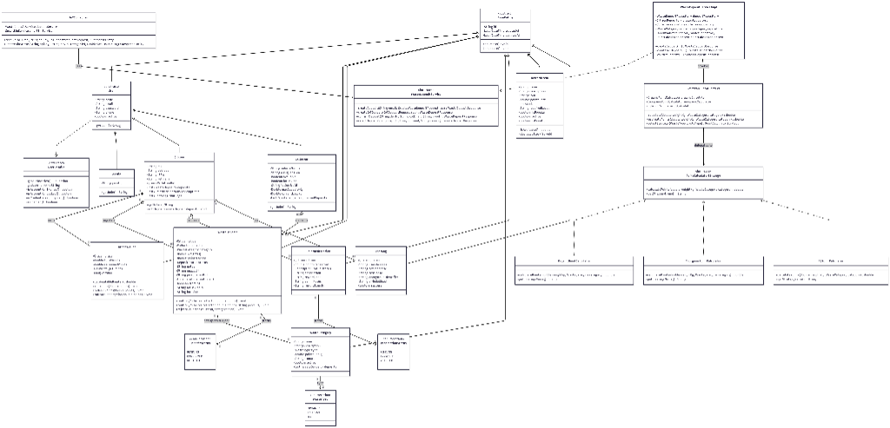

# NetraSphere — TriNetra: Smart Community Waste System 🌿

Sistem Pengelolaan Sampah Komunitas Cerdas (Smart Community Waste System) terintegrasi yang menggabungkan pengelolaan sampah berbasis warga, gamifikasi (*Green Wallet*), integrasi perangkat keras IoT (*NetraDUMP*), dan asisten kecerdasan buatan (*AI Chatbot*). Proyek ini dibangun menggunakan standar industri untuk memenuhi Tugas Besar pemrograman berorientasi objek (PBO) kelas reguler.

---

## 📸 Diagram Kelas Sistem (Class Diagram)

Berikut adalah visualisasi arsitektur dan hubungan antar kelas dalam sistem **NetraSphere / TriNetra** secara menyeluruh:

<p align="center">
  
</p>

---

## ✨ Fitur Utama

Sistem ini memiliki 3 panel dashboard utama yang disesuaikan dengan peran masing-masing pengguna (**RBAC**):

1.  **Dashboard Warga (Citizen)**
    *   **Green Wallet**: Dompet digital penyimpan poin ramah lingkungan (*Green Points*).
    *   **Setor Sampah**: Pencatatan setoran sampah manual (unggah bukti foto) dan setoran otomatis via IoT.
    *   **Katalog Hadiah & Donasi**: Penukaran poin yang terkumpul dengan bahan pokok (*Reward Items*) atau donasi sosial (tanam pohon, pakan hewan liar).
    *   **AI Chatbot**: Asisten pintar berbasis **Mistral AI** untuk konsultasi pemilahan sampah dan estimasi poin secara real-time.
    *   **Peta Lokasi & Badges**: Sistem gamifikasi dengan pencapaian lencana keaktifan (*Badges*).

2.  **Dashboard Petugas (Collector / Robot IoT)**
    *   **Tugas Aktif**: Mengonfirmasi setoran sampah warga (mengubah status `PENDING` $\rightarrow$ `CONFIRMED` disertai unggah foto bukti pickup).
    *   **Catat Setoran Manual**: Memfasilitasi pencatatan setoran langsung di lapangan.
    *   **Statistik Muatan**: Memantau kapasitas kendaraan pengangkut secara real-time.
    *   **IoT Endpoint**: Bertindak sebagai device sensor otonom untuk smart bin yang mengirim data timbangan langsung via API.

3.  **Dashboard Administrator (Admin)**
    *   **Manajemen Pengguna**: Mengelola status akun Admin, Warga, dan Petugas.
    *   **Katalog Sampah**: Menambahkan jenis kategori sampah beserta bobot nilai poin per kilogram.
    *   **Katalog Hadiah**: Menambah/mengedit barang dan stok di toko penukaran poin.
    *   **Verifikasi Penukaran Poin**: Meninjau dan menyetujui request penukaran poin warga.
    *   **Analitik & Pelaporan Ekspor**: Visualisasi tren setoran harian dan ekspor data laporan ke format **PDF & CSV**.

---

## 🧠 Konsep OOP yang Diimplementasikan

Proyek ini mendemonstrasikan penerapan pilar-pilar OOP secara menyeluruh dan mendalam:

1.  **Abstraction (Abstraksi) & Inheritance (Pewarisan)**
    *   **`BaseEntity` (Abstract Superclass)**: MappedSuperclass universal untuk menyediakan atribut ID (UUID) serta timestamp audit (`createdAt`, `updatedAt`) dengan *lifecycle callbacks* JPA.
    *   **`User` (Abstract Superclass)**: Kelas dasar pengguna yang mengimplementasikan `UserDetails` (Spring Security). Diwarisi secara terstruktur menggunakan strategi database **JPA JOINED** oleh subclass konkret: `Admin`, `Citizen`, dan `Collector`.
    *   **Polimorfisme Metode**: Metode abstrak `public abstract String getRole()` di-override oleh masing-masing subclass untuk menghasilkan peran yang dinamis.

2.  **Polymorphism (Polimorfisme) via Strategy Pattern**
    *   **`PointCalculatorStrategy` (Interface)**: Kontrak logika kalkulasi poin.
    *   **Concrete Strategies**: `OrganicPointCalculator`, `InorganicPointCalculator`, dan `B3PointCalculator` (masing-masing memiliki pengali bobot poin dan bonus yang berbeda).
    *   **`PointCalculatorContext`**: Memilih strategi kalkulasi poin secara dinamis saat runtime (*runtime polymorphism*) berdasarkan tipe sampah dari kategori yang bersangkutan.

3.  **Encapsulation (Enkapsulasi Logika Bisnis)**
    *   **`GreenWallet`**: Saldo poin (`totalPoints` & `redeemedPoints`) tidak dapat dimanipulasi langsung dari luar kelas. Perubahan wajib melalui metode bisnis internal yang memiliki proteksi validasi ketat, seperti `addPoints()`, `redeemPoints()`, dan `rollbackRedemption()`.
    *   **`WasteDeposit`**: Transisi state transaksi (PENDING, CONFIRMED, REJECTED) dienkapsulasi aman di dalam metode entitas `confirm()` dan `reject()`.

---

## 🛠️ Cara Instalasi & Menjalankan Projek

### 1. Prasyarat System
*   **Java JDK**: Versi 17 atau lebih baru.
*   **Maven**: Versi 3.x.
*   **MySQL Server**: Versi 8.x.

### 2. Persiapan Database
1.  Buka terminal MySQL Anda dan buat database baru:
    ```sql
    CREATE DATABASE db_tubes_pbo_trinetra;
    ```
2.  Import skema dan data awal menggunakan dump SQL yang tersedia di root folder proyek:
    *   Menggunakan `db_tubes_pbo_trinetra.sql` atau `database_dump.sql` ke dalam database `db_tubes_pbo_trinetra`.
    *   *Alternatif*: Anda juga dapat mengandalkan **Data Seeder Otomatis** bawaan Spring Boot saat aplikasi pertama kali dijalankan (pastikan tabel kosong agar seeder memicu pengisian data secara otomatis).

### 3. Konfigurasi Kredensial
Gunakan Environment Variables atau buat file `application.yml` lokal di `src/main/resources/` (file ini diabaikan oleh Git).
```yaml
spring:
  datasource:
    url: jdbc:mysql://localhost:3306/db_tubes_pbo_trinetra?useSSL=false&serverTimezone=UTC
    username: root          # Ganti dengan username MySQL Anda
    password: YOUR_DB_PASSWORD # Ganti dengan password MySQL Anda
    driver-class-name: com.mysql.cj.jdbc.Driver

# Konfigurasi Fitur Integrasi (Opsional)
app:
  iot:
    api-key: YOUR_IOT_SECRET
  mistral:
    api-key: YOUR_MISTRAL_API_KEY # Masukkan API Key Mistral AI untuk mengaktifkan chatbot
```

### 4. Menjalankan Aplikasi
Buka terminal tepat di root direktori proyek, lalu eksekusi perintah Maven berikut:
```bash
export ADMIN_PASSWORD=katasandikuat123
mvn clean spring-boot:run
```
Setelah proses startup sukses, buka browser Anda dan akses:
👉 **`http://localhost:8081`**

---

## 👤 Manajemen Akses (Security Warning)

> [!WARNING]
> Mulai dari pembaruan keamanan terbaru, tidak ada akun *dummy* yang disertakan secara otomatis di kode sumber.
> Administrator pertama akan dibuat berdasarkan nilai Environment Variable `ADMIN_PASSWORD` yang dimasukkan sebelum menjalankan server.
> Segala pengaturan otentikasi kini dilindungi dengan 2FA/MFA Google Authenticator.

---

## 📋 Swagger API Dokumentasi (IoT-Ready)

Setelah aplikasi berjalan, dokumentasi REST API untuk integrasi hardware IoT (smart bin/robot) dapat diakses secara interaktif pada:
👉 **`http://localhost:8080/swagger-ui.html`**

---
**Tim Trinetra** — *Inovasi Cerdas untuk Bumi yang Lebih Hijau.*
